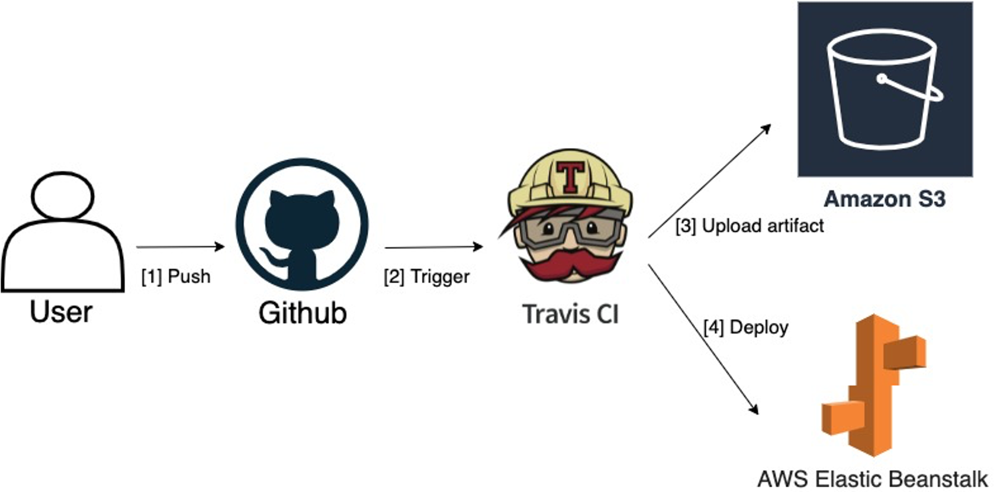
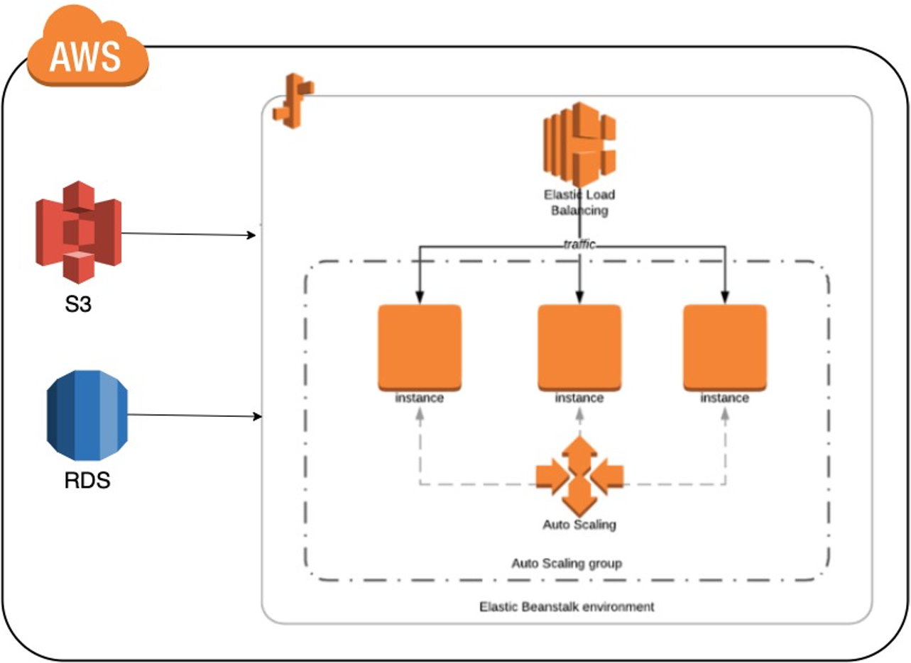
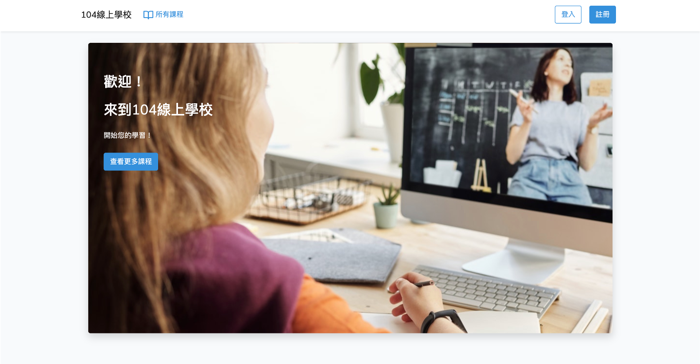
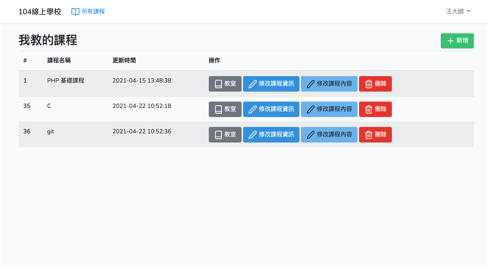
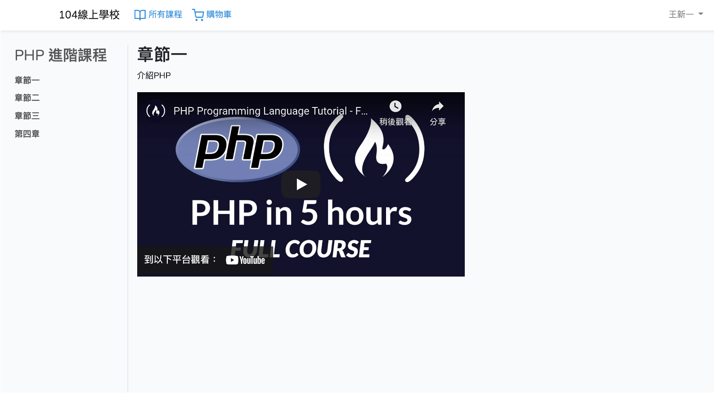
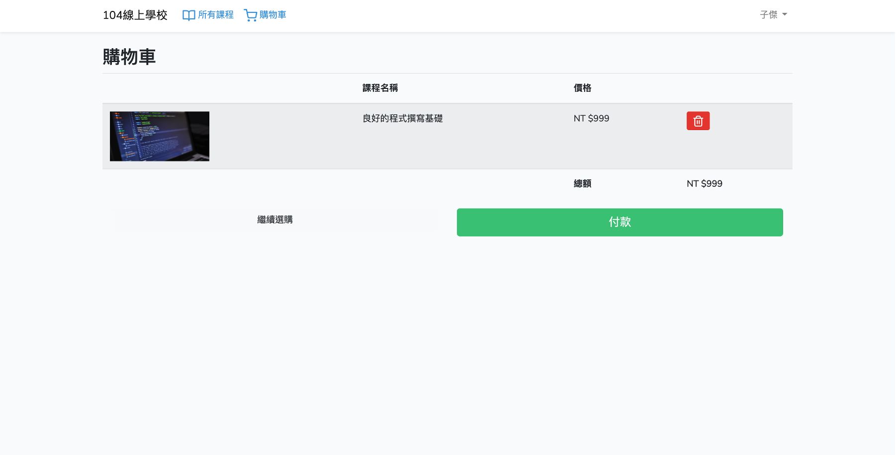
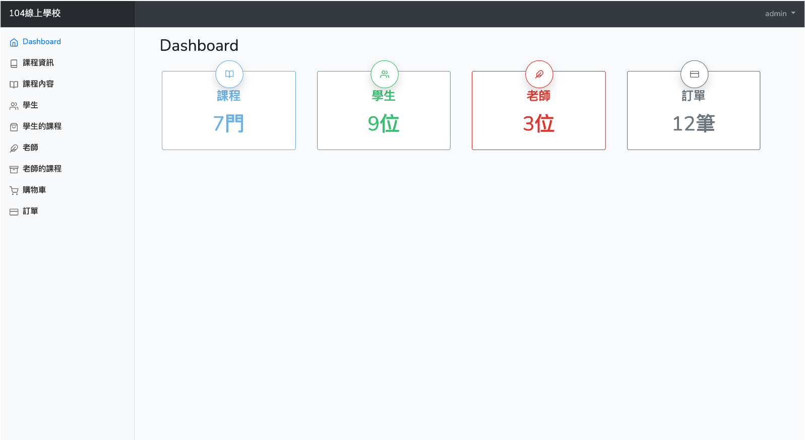

# 104線上學校

## 運行環境需求

參照官方文件 [Laravel 6 requirements](https://laravel.com/docs/6.x#server-requirements) 可達最低運行需求。

## 必要工具

- Docker
- Docker Compose

## 系統架構
### CI / CD

### AWS

## 系統截圖
首頁

教師

教室

購物車

管理者

